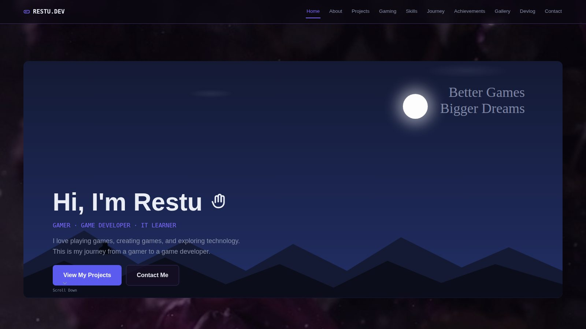
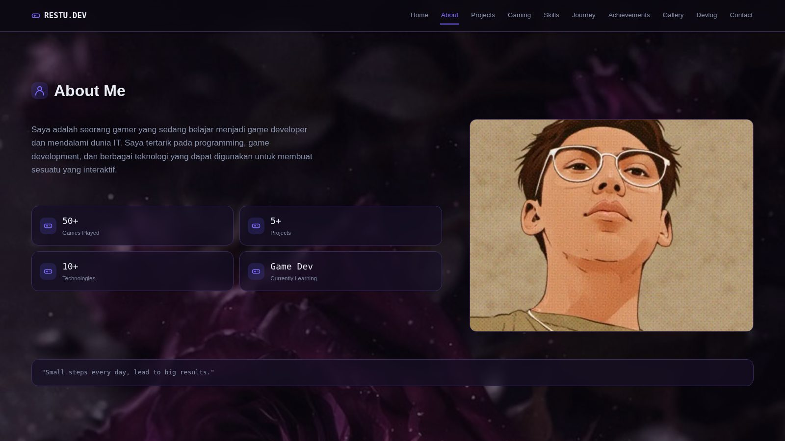
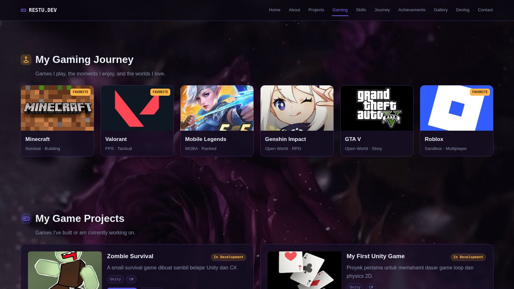
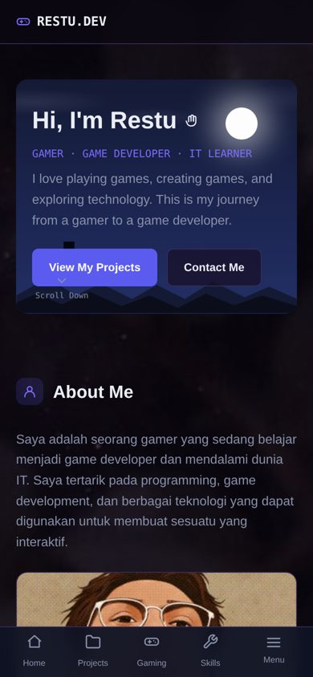

# RESTU.DEV — Personal Portfolio Website

<p>
  
  
  
  
  
</p>

Website portofolio pribadi bertema *"From Gamer to Game Developer"*. Dibangun dengan HTML, CSS, dan JavaScript murni (vanilla, tanpa framework), sepenuhnya statis sehingga bisa langsung di-*deploy* ke GitHub Pages atau hosting statis lainnya.

---

## Pratinjau Tampilan

**Hero (desktop)**



**About Me** — bio, statistik, dan avatar



**Gaming Journey** — kartu game bisa diklik menuju halaman game



**Tampilan mobile**



> Semua screenshot diambil langsung dari `index.html` yang sudah jadi.

---

## Fitur

- **Hero Section** — perkenalan singkat dengan foto latar bertema malam yang "hidup": efek Ken Burns (zoom & geser pelan otomatis) plus kunang-kunang melayang berkedip
- **Background Parallax** — gambar mawar ungu sebagai latar seluruh halaman; ikut bergerak saat di-*scroll* (lebih pelan dari konten sehingga terasa ada kedalaman)
- **Layout Full Desktop** — konten melebar memenuhi layar (hingga 1440px, dan 1680px di layar sangat lebar), bukan lagi kolom sempit di tengah
- **About Me** — bio, statistik ringkas di bawah bio (di samping avatar), lalu kutipan di baris paling bawah
- **Gaming Journey** — kartu game dengan gambar cover dan badge *Favorite*; **klik kartu untuk membuka halaman game** di tab baru
- **Game Projects** — daftar proyek game dengan thumbnail, status (*In Development* / *Completed*), tombol *Play Demo* dan *GitHub*
- **IT / Programming Projects** — daftar proyek IT non-game; setiap kartu adalah tautan
- **Skills** — daftar skill dengan indikator level (Learning / Familiar / Intermediate / Advanced)
- **Learning Journey** — linimasa (timeline) proses belajar, dengan kartu **mini game pixel art** di sampingnya: karakter kecil berlari, melompati rintangan, dan mengambil koin secara otomatis (murni animasi, tanpa kontrol); obor berkedip dan debu melayang. Animasi berhenti sendiri saat kartu tidak terlihat
- **Achievements** — daftar pencapaian
- **Gallery** — grid foto; **klik foto untuk memperbesar** (lightbox), tutup dengan tombol X, klik area gelap, atau tombol `Esc`
- **Devlog** — daftar catatan pengembangan
- **Contact** — daftar kontak + formulir pesan (belum terhubung ke backend apa pun)
- **Navigasi responsif** — menu atas untuk desktop, tab bar bawah + drawer "Menu" untuk mobile
- **Ramah aksesibilitas** — animasi otomatis dimatikan bagi pengguna yang mengaktifkan *reduce motion* di perangkatnya

---

## Struktur Folder

```
restu-portfolio/
├── index.html          # Struktur halaman (semua section + lightbox galeri)
├── README.md
├── css/
│   └── style.css       # Semua styling (termasuk animasi hero & layout desktop)
├── images/             # Semua gambar (avatar, cover game, thumbnail proyek, galeri, ikon sosial, background)
└── js/
    ├── data.js         # Semua konten/data (edit di sini untuk update isi)
    ├── backend.js      # Placeholder koneksi Firebase (belum aktif)
    ├── render.js       # Mengubah data.js menjadi elemen HTML
    ├── nav.js          # Navigasi (menu mobile, scroll-active) + lightbox galeri
    ├── animations.js   # Efek animasi saat scroll (reveal)
    ├── parallax.js     # Gerak background saat di-scroll
    └── pixel-scene.js  # Animasi mini game di kartu Journey (canvas)
```

### Isi folder `images/`

| File | Dipakai di |
|---|---|
| `avatar.jpg` | Foto profil di About Me |
| `bg-roses.jpg` | Background seluruh halaman (parallax) |
| `hero-bg.jpg` | Foto latar bergerak (Ken Burns) di Hero |
| `game-minecraft.jpg`, `game-valorant.jpg`, `game-mobilelegends.jpg`, `game-genshin.jpg`, `game-gtav.jpg`, `game-roblox.jpg` | Cover di Gaming Journey |
| `project-sunset-island.jpg`, `project-shiesty-club.jpg` | Thumbnail Game Projects |
| `pixel-scene.jpg` | Latar animasi mini game di kartu Journey |
| `gallery-1.jpg` … `gallery-6.jpg` | Galeri |
| `icon-github.jpg`, `icon-discord.jpg`, `icon-instagram.jpg`, `icon-youtube.jpg` | Ikon sosial & kontak |
| `preview-*.jpg` | Screenshot untuk README ini saja (boleh dihapus jika tidak diperlukan) |

---

## Cara Menjalankan

Proyek ini statis, tidak perlu instalasi atau server khusus.

1. Unduh / clone folder `restu-portfolio`.
2. Buka file `index.html` langsung di browser, **atau**
3. Jalankan lewat *live server* lokal (mis. ekstensi "Live Server" di VS Code) agar path relatif (CSS/JS/gambar) selalu berjalan konsisten.

Setelah mengubah file, refresh dengan **Ctrl + F5** agar cache browser dibersihkan.

Untuk publikasi online, folder ini bisa langsung diunggah ke **GitHub Pages**, **Netlify**, atau **Vercel** tanpa proses build tambahan.

---

## Cara Mengubah Konten

Semua konten (nama game, daftar proyek, skill, achievement, dll.) terpusat di satu file:

```
js/data.js
```

Cukup ubah isi array/objek di file tersebut (contoh: `DATA_GAMES`, `DATA_GAMEDEV`, `DATA_ITPROJECTS`, `DATA_SKILLS`, dst.), lalu `render.js` akan otomatis menampilkannya ke halaman — tidak perlu menyentuh `index.html` maupun `render.js`.

### Cara menambahkan link

| Yang ingin diberi link | Di `data.js` | Field yang diisi |
|---|---|---|
| Kartu game (Gaming Journey) | `DATA_GAMES` | `url` |
| Gambar & tombol proyek game | `DATA_GAMEDEV` | `demo` (Play Demo + gambar) dan `repo` (GitHub) |
| Proyek IT | `DATA_ITPROJECTS` | `url` |
| Ikon sosial di footer | `SOCIAL_LINKS` | `url` |
| Kontak | `DATA_CONTACT` | `url` |

Contoh:

```js
{name:"Sunset Island", ..., demo:"https://www.roblox.com/share?code=...", repo:"https://github.com/username/sunset-island"}
```

- Link yang diawali `https://` otomatis terbuka di **tab baru**.
- Link yang masih `"#"` atau kosong **tidak melakukan apa-apa** saat diklik (tidak membuka tab kosong).

### Cara mengganti gambar

Simpan gambar baru di folder `images/` lalu ubah nama file di field `img` pada `data.js` (atau timpa file lama dengan nama yang sama). Untuk galeri, ubah `DATA_GALLERY` (field `img` dan `caption`).

### Pengaturan lain

- **Kecepatan gerak background:** ubah angka `F = 0.28` di `js/parallax.js` (`0` = diam, makin besar makin cepat).
- **Foto latar Hero:** kecepatan & jarak zoom Ken Burns diatur lewat `@keyframes heroKenBurns` di `css/style.css` (ubah `scale()` dan durasi `animation` pada `.hero-photo-img`).
- **Mini game Journey:** kecepatan lari, tinggi lompatan, dan jumlah koin diatur di bagian atas `js/pixel-scene.js` (`SPEED`, `JUMP_H`) dan fungsi `spawnLevel()`.
- **Gelap/terang background:** ubah nilai `rgba(11,8,18,…)` pada `.bg-parallax` di `css/style.css`.

### Data yang masih placeholder

- `DATA_CONTACT` — email, username GitHub, dan Discord masih contoh (`example@gmail.com`, `@username`)
- `SOCIAL_LINKS` — semua tautan sosial media masih `#`
- `DATA_GAMEDEV` — tautan *Play Demo* Sunset Island & Shiesty Club sudah mengarah ke Roblox; tombol *GitHub* masih `#` (isi kalau ada repo-nya)
- `DATA_ITPROJECTS` — tautan proyek masih `#`
- `DATA_GAMES` — `url` saat ini mengarah ke website resmi tiap game; ganti dengan link profilmu jika ingin
- **Favicon** (ikon tab browser) belum dipasang
- Teks statistik, skill, journey, achievement, dan devlog masih contoh — sesuaikan dengan data aslimu

---

## Backend (Opsional)

Form kontak saat ini bersifat statis (`onsubmit="return false"`) dan belum tersambung ke mana pun. File `js/backend.js` sudah berisi kerangka kode untuk menghubungkan ke **Firebase Firestore** jika suatu saat ingin form kontak benar-benar menyimpan pesan. Langkah aktivasinya sudah dijelaskan sebagai komentar di dalam file tersebut.

---

## Teknologi yang Digunakan

<p>
  
  
  
  
  
</p>

Font yang dipakai: **Space Grotesk**, **JetBrains Mono**, dan **Caveat** (dimuat via Google Fonts).

---

## Catatan Hak Cipta Gambar

Cover game (Minecraft, Valorant, Mobile Legends, Genshin Impact, GTA V, Roblox) dan logo sosial media adalah **milik masing-masing pemegang merek**. Gambar-gambar ini dipakai hanya sebagai ilustrasi di portofolio pribadi. Pastikan kamu memahami ketentuan penggunaannya sebelum mempublikasikan situs ini secara luas, dan ganti dengan screenshot milikmu sendiri jika diperlukan.

Gambar pixel art di kartu Journey, gambar background mawar, dan foto galeri juga sebaiknya dipastikan sumber & hak pakainya oleh pemilik proyek.

---

## Lisensi

Belum ada file lisensi disertakan. Kalau proyek ini ingin dibagikan secara publik dengan lisensi tertentu (mis. MIT), tambahkan file `LICENSE` sesuai pilihanmu.

---

<p align="center">
  <sub>Dibuat oleh Restu — Play · Code · Create</sub>
</p>
